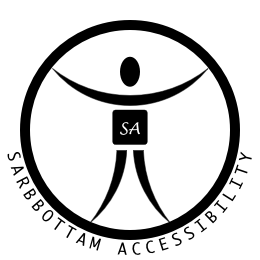

accessibility-logo
---

## Generic

A human figure within a ring, with a square torso. The torso can be replaced with brand specific square icon or favicon.

## Extended

Torso replaced with "Sarbbottam Accessibility" square icon and annotated with "SARBBOTTAM ACCESSIBILITY" circular text along the circumference of the ring.

## Inspiration

- [mac accessibility icon](inspiration/mac.png)
- [android accessibility icon](inspiration/android.png)
- [vitruvian man](https://en.wikipedia.org/wiki/Vitruvian_Man)
- [logo designs by Yoga Perdana](http://yoga.dribbble.com/)

## Why?

I could not find a generic accessibility logo that could be themed or extended, thus created one.
Hope it would be helpful.

## Trivia

Primary shapes are built with circles.

---

Copyright (c) 2016 Sarbbottam Bandyopadhyay
